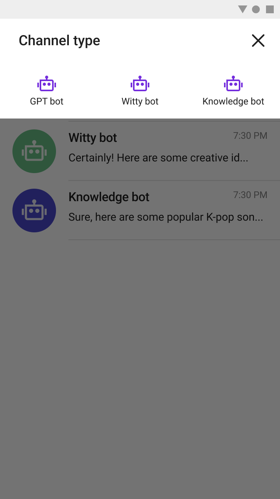
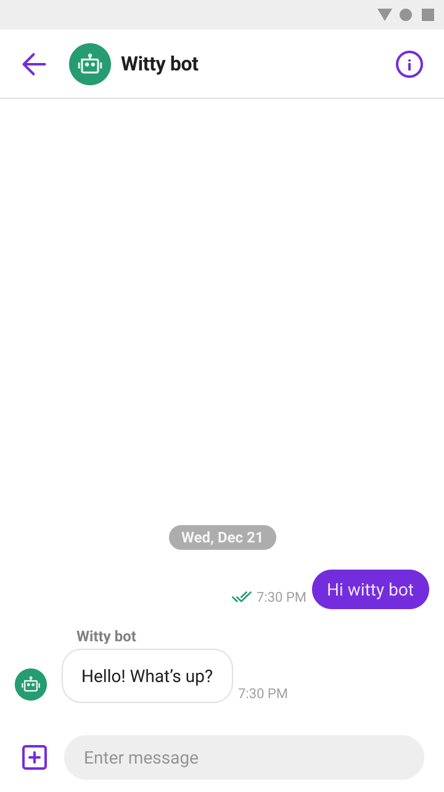

# Sendbird ChatGPT Sample for Android
This is an example of [Sendbird ChatGPT Bot](https://sendbird.com/docs/chat/v3/platform-api/bot/bot-overview#1-overview) for Android, implemented using [Sendbird UIKit](https://sendbird.com/docs/uikit/v3/android/overview).
<p>
Sendbird ChatGPT Bot is a GPT3-powered bot that's built on top of Sendbird's existing bots. It can provide your users with highly engaging and natural conversational experience. It's integrated natively inside Sendbird so that you don't have to worry about developing and deploying OpenAI services separately.  

</p>

<p align="center">
  
  
</p>

## Requirements
The minimum requirements for ChatGPT sample for Android are:
* Android 5.0 (API level 21) or higher
* Java 8 or higher
* Support androidx only
* Android Gradle plugin 4.0.1 or higher
* Sendbird UIKit SDK for Android 3.2.0 and later
* Sendbird Chat SDK for Android 4.0.8 and later

## Getting Started
1. Create your Sendbird application on [the dashboard](https://dashboard.sendbird.com/auth/signup).
2. [Register the ChatGPT bot](https://sendbird.com/developer/tutorials/chatgpt-integration-build-a-chatgpt-powered-chatbot-part-1) in your Sendbird application.
3. In this example, we're connected to a test Sendbird application and pre-defined bots. To connect yours, replace `APP_ID`, `ChatGPTInfo` and others in the `BaseApplication.kt` file as follows:

```kotlin
class BaseApplication : Application() {
    companion object {
        // TODO Replace with your own APP_ID
        const val APP_ID = "13B6D179-33A5-4C0D-9162-E11DAC9358FC"

        // TODO Replace with your own USER_ID
        const val USER_ID = "sendbird"

        // TODO Replace with your own NICKNAME
        const val NICKNAME = "sendbird"

        // TODO Replace with your own PROFILE_URL
        const val PROFILE_URL = ""

        // ...
    }

    // ...
}

object ChatGPTInfo {
    // TODO Replace with your own user ids of bots
    const val GPT_BOT_USER_ID = "gpt_bot"
    const val WITTY_BOT_USER_ID = "gpt_bot2"
    const val KNOWLEDGE_BOT_USER_ID = "gpt_bot3"
}
```
4. Run `app`

## How to connect a channel to a bot
This sample supports chat with 3 different bots. They are trained with 3 different characteristics.
Currently, Only 1:1 chat with ChatGPT bot is supported. When you create a channel, you just need to enter the user ID of the bot you want to chat with.

```kotlin
private fun startWithChatGPTBot(botUserId: String) {
    val params = GroupChannelCreateParams()
    params.operatorUserIds = listOf(SendbirdUIKit.getAdapter().userInfo.userId)
    params.userIds = listOf(botUserId)
    GroupChannel.createChannel(params, object : GroupChannelCallbackHandler {
        override fun onResult(channel: GroupChannel?, e: SendbirdException?) {
            if (e != null || channel == null) {
                return
            }
            startActivity(ChannelActivity.newIntent(requireContext(), channel.url))
        }
    })
}
```

For more information, see [our documentation](https://sendbird.com/docs/chat/v3/platform-api/bot/bot-overview#1-overview) and [our tutorial](https://sendbird.com/developer/tutorials/chatgpt-integration-build-a-chatgpt-powered-chatbot-part-1).
